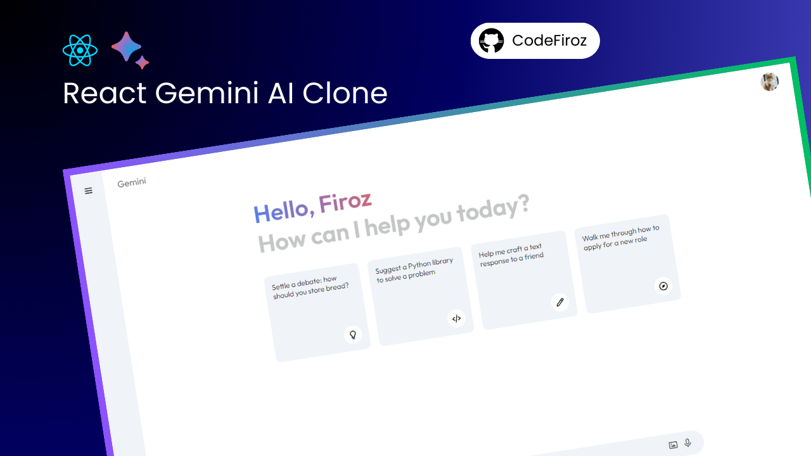

<p align="center">
  
</p>

# Gemini AI Clone

A modern, responsive web application inspired by Google's Gemini AI, built with React. This project demonstrates a conversational AI interface, authentication flow, and a clean, user-friendly design.

## 🚀 Features

- Conversational AI chat interface
- User authentication (Login & Verification)
- Sidebar navigation
- Responsive and modern UI
- State management with custom store

## 📸 Screenshots

<p align="center">
  
</p>

## 🛠️ Tech Stack

- [React](https://reactjs.org/)
- [JavaScript](https://developer.mozilla.org/en-US/docs/Web/JavaScript)
- [CSS](https://developer.mozilla.org/en-US/docs/Web/CSS)

## 📦 Getting Started

1. **Clone the repository:**
   ```bash
   git clone https://github.com/lalitkumarjangid/GeminiTry.git
   cd gemini-ai-clone-main
   ```

2. **Install dependencies:**
   ```bash
   npm install
   ```

3. **Start the development server:**
   ```bash
   npm start
   ```
   The app will run at [http://localhost:3000](http://localhost:3000)

## 🗂️ Project Structure

```
src/
  component/
    Home.js
    Login.js
    Main.js
    Sidebar.js
    Verify.js
    gemini-clone.png
  store/
    useAppStore.js
  App.js
  index.js
  ...
public/
  index.html
  ...
```

## 🤝 Contributing

Contributions are welcome! Please open issues or submit pull requests for improvements.

## 📄 License

This project is licensed under the MIT License.

---

<p align="center">
  Made with ❤️ by [lalitkumarjangid](https://github.com/lalitkumarjangid)
</p>
